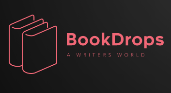
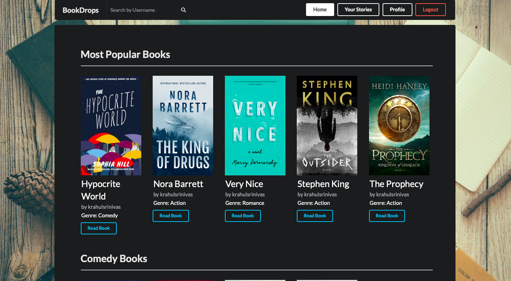
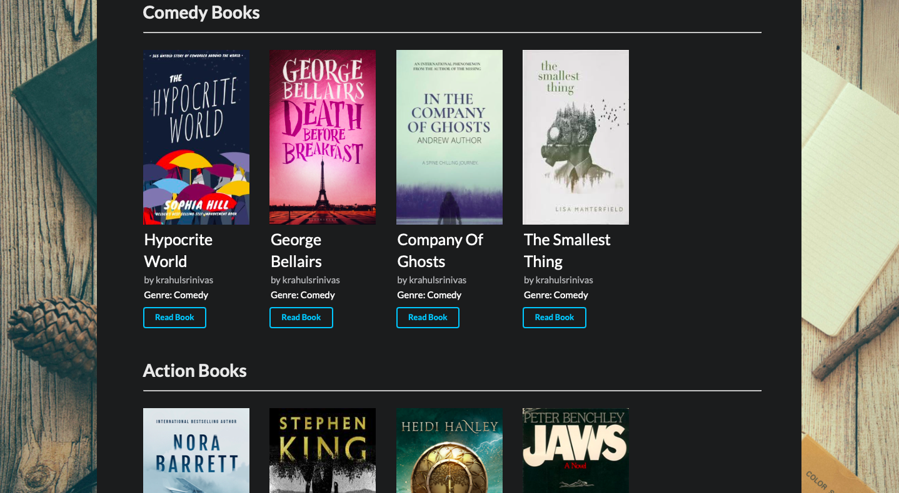
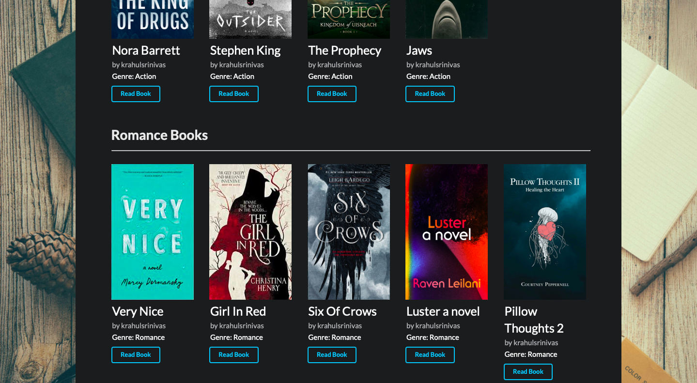
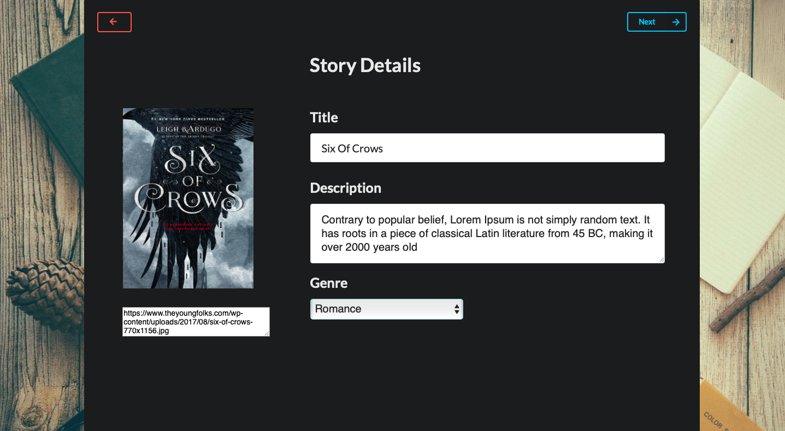
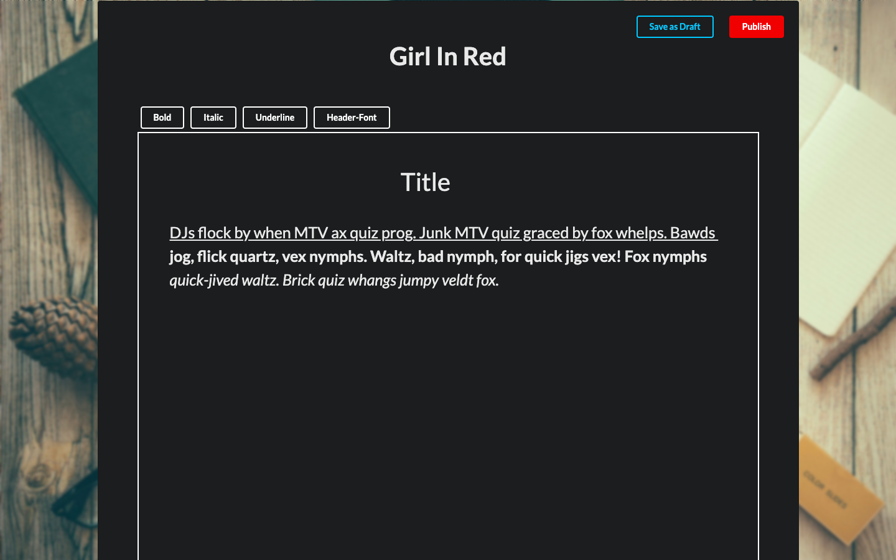
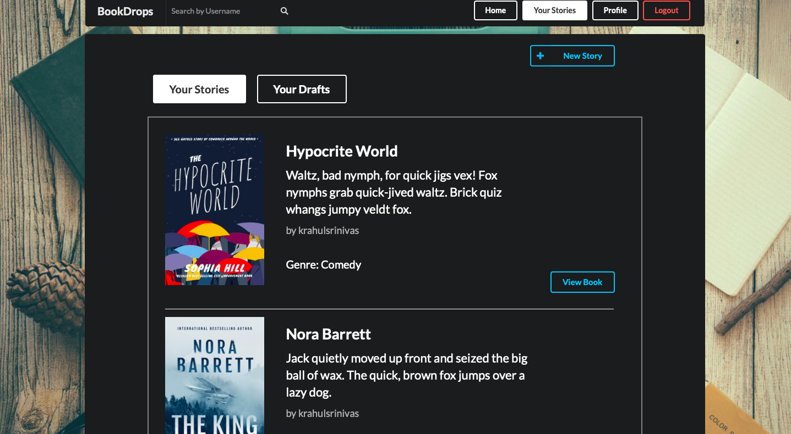
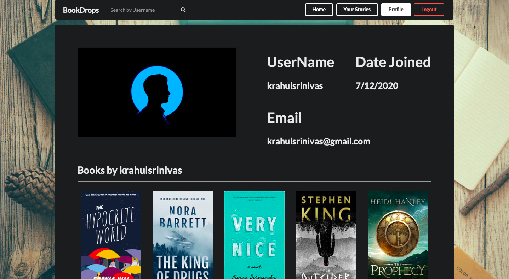

# **BookDrops**

### BookDrops is a full stack website built for writers to freely write and pubilsh books on the site. We live in a world where there are a lot of young writers and this platform helps in meeting and learning from like minded people.
 

## Stack used (MERN)

* React in the frontend (React Hooks).
* Semantic Ui for external and prebuilt css.
* Node.js for our javascript server.
* MongoDB (Atlas) for our NoSQL database.
* Express.js (framework for Node.js) used for building clear REST APIs 

 
 

## Login/Register pages to make a new account or login to an existing one. It uses cookies and JWT to persist the user to all server requests and has React private routes to disable asscessing pages thorugh the url.
---
 

 
 

## The Homepage consists of all the types of generes the website has to offer including the most popular books to read.
---
 

 
 

## The editor pages help u start writing your book with ease it takes in an image url and title then takes you to the second page lets you start writing your book.
---
 

 

 

## Here you have your Drafts and Stories pages. The Drafts are all the books u are currently writing and only for you to see. Where as the Stories are all the books u have published for others to view.
---
 

 

 

## This page shows a users profile. Here u can see his picture and email and all the books that particular user has written.
---
 

 